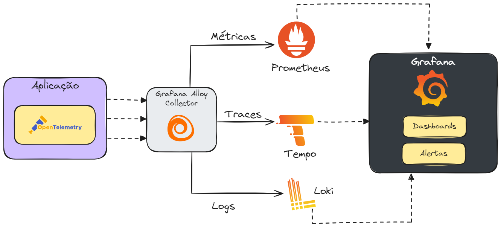

# opentelemetry-grafana_devops-experience-2025-05
Apresentação sobre o uso de OpenTelemetry + Grafana no monitoramento de aplicações. Palestra realizada durante a edição de Maio-2025 do evento DevOps Experience.

Uma representação simplificada de implementação com o ecossistema Grafana + OpenTelemetry + Prometheus:

Aplicações (incluindo ambiente para uso de Grafana + OpenTelemetry com scripts do Docker Compose):
- [**API de Contagem de acessos (.NET 9 + ASP.NET Core)**](https://github.com/renatogroffe/aspnetcore9-otel-jaeger-postgres-mysql_apicontagem)
- [**API Saudações (Node.js)**](https://github.com/renatogroffe/nodejs-otel-jaeger_apisaudacoes)
- [**Consumer das APIs (Java + Spring + Apache Camel)**](https://github.com/renatogroffe/nodejs-otel-jaeger_apisaudacoes)
- [**Inteligência Artificial com Semantic Kernel + .NET 9 + Grafana**](https://github.com/renatogroffe/dotnet9-semantickernel-postgres-otel-grafana_consultaprodutos)
