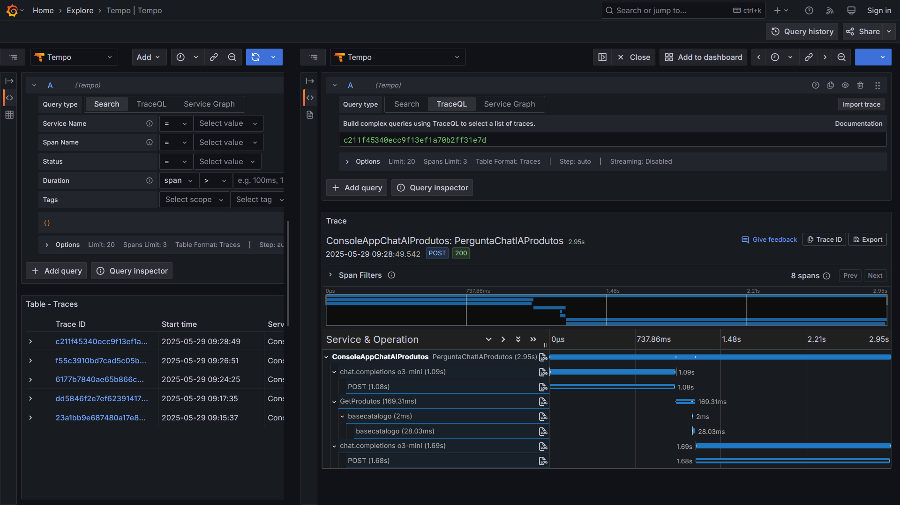

# opentelemetry-grafana_devops-experience-2025-05
Apresentação sobre o uso de OpenTelemetry + Grafana no monitoramento de aplicações. Palestra realizada durante a edição de Maio-2025 do evento DevOps Experience.

Uma representação simplificada de implementação com o ecossistema Grafana + OpenTelemetry + Prometheus:

Aplicações (incluindo ambiente para uso de Grafana + OpenTelemetry com scripts do Docker Compose):
- [**API de Contagem de acessos (.NET 9 + ASP.NET Core)**](https://github.com/renatogroffe/aspnetcore9-otel-jaeger-postgres-mysql_apicontagem)
- [**API Saudações (Node.js)**](https://github.com/renatogroffe/nodejs-otel-jaeger_apisaudacoes)
- [**Consumer das APIs (Java + Spring + Apache Camel)**](https://github.com/renatogroffe/nodejs-otel-jaeger_apisaudacoes)
- [**Inteligência Artificial com Semantic Kernel + .NET 9 + Grafana**](https://github.com/renatogroffe/dotnet9-semantickernel-postgres-otel-grafana_consultaprodutos)

Exemplo de trace mostrando a comunicação entre as aplicações .NET, Java e Node.js:

Trace demonstrando o uso de Azure OpenAI na aplicação criada com .NET 9 + Semantic Kernel:

---

Título da apresentação: **Observabilidade Unificada com OpenTelemetry: tracing de aplicações distribuídas em várias stacks**

Data: **29/05/2025 (quinta-feira)**

Tipo do evento: **Online**

Ferramenta de transmissão: **Zoom**

Tecnologias e tópicos abordados: **Grafana, Grafana Tempo, Grafana Loki, Grafana Alloy, OpenTelemetry, Prometheus, Observabilidade, Monitoramento, SRE, Containers, DevOps, Microsoft Azure, Azure OpenAI, Azure Monitor, Docker, Docker Compose, .NET, ASP.NET Core, Java, Spring, Apache Camel, Node.js SQL Server, PostgreSQL, MySQL, Linux, CNCF, Cloud Native...**

Número de participantes: **88 pessoas (pico de audiência ao longo da live)**

Link do evento: [**LinkedIn**](https://www.linkedin.com/posts/devopsheroes_o-renato-groffe-ta-confirmado-para-a-edi%C3%A7%C3%A3o-activity-7320551983067615234-Tzy_/)

Esta palestra foi realizada em conjunto com meu amigo **Diego Moreira Matos (Microsoft MVP)**.

Deixamos aqui nossos agradecimentos ao **Daniel Ginês** e à **Aline Martins** por todo o apoio para que participássemos como palestrantes de mais uma edição do **DevOps Experience**.

---

Outros prints podem ser encontrados neste [**diretório**](/img/).
